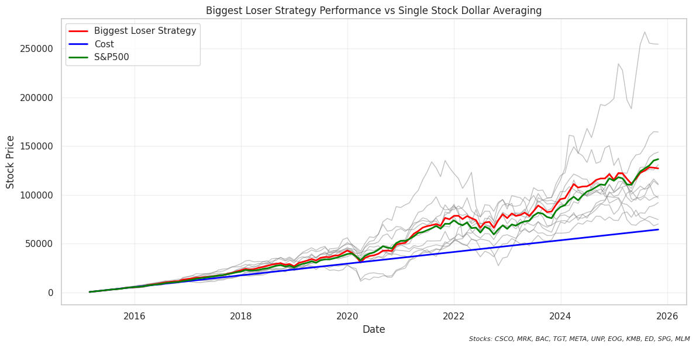
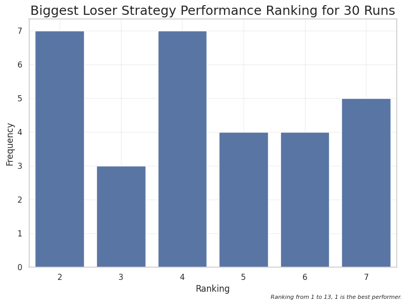

# 🧠 The Biggest Loser Strategy — Investment Simulation Analysis

## 📸 Preview


*A sample plot of the strategy performance compared to dollar-cost averaging.*

---
This repository contains a **Jupyter Notebook** that analyzes an experimental investment strategy called **"The Biggest Loser Strategy"**, which explores the idea of buying familiar stocks at their relative lows.

The strategy is simple:

> Among a selected group of stocks, each month buy the one with the **lowest monthly gain** (or the biggest loser).

The underlying philosophy is that if an investor maintains long-term loyalty to a set of companies, buying them when they’re “on sale” could lead to better average cost and performance over time.

---

## 📊 Project Overview

The notebook walks through three main stages of analysis:

### 1. Data Gathering

- Fetches **historical price data since 2015** for the **top 10 companies in each sector**.
  
- Cleans and organizes the data for further analysis.
  

### 2. Strategy Simulation

- Implements and simulates the **Biggest Loser Strategy** across the historical data.
  
- Compares it against traditional **dollar-cost averaging (DCA)** for individual stocks.
  
- Visualizes the **strategy performance** through plots and cumulative returns.
  

### 3. Evaluation & Ranking

- Compares the strategy results versus DCA on each stock.
  
- Ranks the outcomes across multiple simulations.
  
- Evaluates whether the strategy offers a measurable advantage over passive investing.
  

---

## 💡 Key Idea

This strategy tests a **contrarian investment approach** — buying recent underperformers among your favorite stocks — to explore if this “buy low within a known basket” behavior can outperform simple dollar-cost averaging.

---

## 🧰 Tools & Libraries

- **Python 3**
  
- **Jupyter Notebook**
  
- **pandas**, **numpy** — data processing
  
- **matplotlib**, **seaborn** — visualization
  
- **yfinance**  — stock price retrieval
  

---

## 🚀 How to Run

1. Clone this repository:
  
  ```bash
  git clone https://github.com/KuoLiang-hub/investment_strategies.git
  cd investment_strategies
  ```
  
2. Install dependencies:
  
  ```bash
  pip install -r requirements.txt
  ```
  
3. Launch the Jupyter Notebook:
  
  ```bash
  jupyter notebook
  ```
  
4. Open `biggest_loser_strategy.ipynb` and run all cells.
  

---

## 📈 Example Outputs

- Monthly performance comparisons between the strategy and DCA.
  
- Ranking charts showing how often the strategy outperforms DCA.
  

---

## 🧭 Conclusion

This notebook demonstrates how behavioral ideas like “buying the dip” among familiar stocks can be quantified and tested with real data.  
While not a recommendation for actual investing, it serves as an interesting data-driven exploration of strategy performance over time.


*A Bar plot of the strategy rankings compared to dollar-cost averaging.*
---

## ⚠️ Disclaimer

This project is for **educational and research purposes only**. It does **not** constitute financial advice or investment recommendations.

---